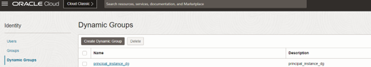
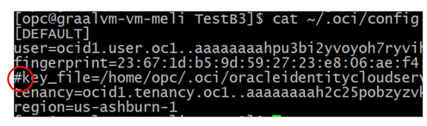
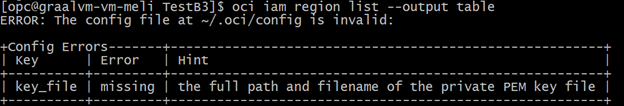
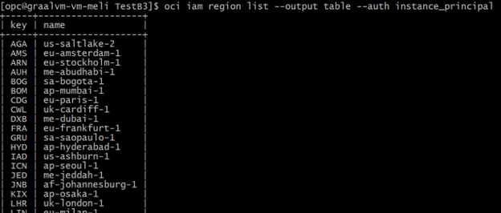
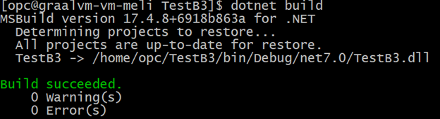
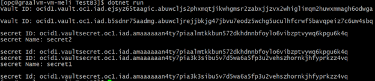

# Secure OCI Access with Instance Principals: CLI and .NET Examples for Vault and Secrets

## Introduction

This tutorial explains how to use **OCI Instance Principals** to allow an **Oracle Linux Compute VM** to access OCI services **without using an OCI CLI config file** (no API keys on disk).  

It also includes a practical **OCI .NET SDK** example that authenticates using Instance Principals and lists **Vaults** and **Secrets**.

---

## Prerequisites

- An **OCI Compute Instance** already created (Oracle Linux recommended).
- Access to OCI Console to create:
  - Dynamic Group
  - IAM Policy
- (Optional but recommended) **OCI CLI** installed for testing.
- **.NET SDK** installed on the VM (for the C# example).

---

## Step 1 — Create a Dynamic Group

1. Go to **OCI Console** → **Identity & Security** → **Dynamic Groups**
2. Click **Create Dynamic Group**
3. Give it a name, for example:
   - `principal_instance_dg`

   

### Dynamic Group Matching Rule

Use the OCID of your VM instance:

```
All {instance.id = 'ocid1.instance.oc1.iad.<YOUR_INSTANCE_OCID>'}
```

## Step 2 — Create an IAM Policy

1. Go to OCI Console → Identity & Security → Policies

2. Choose the compartment where you want to grant access (or a higher-level compartment if needed)

3. Click Create Policy

Example Policy Statement

```
Allow dynamic-group principal_instance_dg to manage all-resources in compartment Developer_OCI
```

Replace:
- principal_instance_dg with your Dynamic Group name

- Developer_OCI with your target compartment name

**Note: For production, avoid manage all-resources. Use the minimum permissions required (least privilege).**

## Step 3 — Test with OCI CLI (Recommended)

1. Make sure you have OCI-CLI Installed for testing

If you already have a working OCI CLI configuration file, comment out the key_file parameter and rerun the commands. The commands will fail because OCI authentication through the configuration file is no longer being used.





2. Validate that config-based auth is NOT required (Instance Principal)

Now temporarily comment/remove your config usage (or run without config) and test again.

With Instance Principals, you should run commands using the auth flag:


```
oci os ns get --auth instance_principal

```
If your Dynamic Group + Policy are correct, this will work without requiring ~/.oci/config.



This proves the VM identity (Instance Principal) is being used.

## Step 4 — OCI .NET SDK Using Instance Principals

Instance Principals in the OCI .NET SDK work the same way:

- Instead of API keys/config file authentication, the SDK uses the VM identity.

- The code runs on the VM that you authorized via Dynamic Group and Policy.

Below is a sample .NET app that:

- Authenticates using Instance Principals

- Lists Vaults

- Lists Secrets

1. .NET Example — List Vaults and Secrets
- Create a Console Project


```
dotnet new console -n OciInstancePrincipalDemo
cd OciInstancePrincipalDemo

```

2. Add OCI SDK Packages

**Note: Package names can vary depending on OCI SDK version. Add what your project needs.**

```
dotnet add package OCI.DotNetSDK.Common
dotnet add package OCI.DotNetSDK.Vault
dotnet add package OCI.DotNetSDK.Keymanagement
dotnet add package OCI.DotNetSDK.Identity
```

3. Update `Program.cs`
Replace the compartment OCID with yours.

```
using System;
using System.Threading.Tasks;
using Oci.Common;
using Oci.Common.Auth;
using Oci.VaultService;
using Oci.VaultService.Requests;
using Oci.KeymanagementService;
using Oci.KeymanagementService.Requests;

class Program
{
    static async Task Main(string[] args)
    {
        try
        {
            // Instance Principal Authentication Provider
            var provider = new InstancePrincipalsAuthenticationDetailsProvider();

            // Compartment OCID (replace with yours)
            string compartmentId = "ocid1.compartment.oc1..xxxxxxxxxxxxxxxxxxxxxxxxx";

            // --- List Vaults (KMS Vault Client) ---
            var kmsVaultClient = new KmsVaultClient(provider, new ClientConfiguration());

            var listVaultsRequest = new ListVaultsRequest
            {
                CompartmentId = compartmentId
            };

            var vaultsResponse = await kmsVaultClient.ListVaults(listVaultsRequest);

            Console.WriteLine("=== VAULTS ===");
            foreach (var vault in vaultsResponse.Items)
            {
                Console.WriteLine($"Vault ID: {vault.Id}");
                Console.WriteLine($"Vault Name: {vault.DisplayName}");
                Console.WriteLine();
            }

            // --- List Secrets (Vaults Client) ---
            var vaultsClient = new VaultsClient(provider, new ClientConfiguration());

            var listSecretsRequest = new ListSecretsRequest
            {
                CompartmentId = compartmentId
            };

            var secretsResponse = await vaultsClient.ListSecrets(listSecretsRequest);

            Console.WriteLine("=== SECRETS ===");
            foreach (var secret in secretsResponse.Items)
            {
                Console.WriteLine($"Secret ID: {secret.Id}");
                Console.WriteLine($"Secret Name: {secret.SecretName}");
                Console.WriteLine();
            }
        }
        catch (Exception ex)
        {
            Console.WriteLine($"Error: {ex.Message}");
        }
    }
}
```


4. Build and Run

```
dotnet build
dotnet run
```





Expected output:

- A list of Vaults in the compartment

- A list of Secrets in the compartment


## Troubleshooting
1) NotAuthorizedOrNotFound / 403 Forbidden

- Confirm the Dynamic Group rule uses the correct instance OCID

- Confirm the Policy is created in the correct place (tenancy vs compartment)

- Confirm the policy grants permissions to the correct compartment


2) CLI works with config but not with Instance Principals

- Make sure you include:

```
--auth instance_principal
```

Check that the VM can reach OCI services (network/DNS/proxy)


3) .NET app fails but CLI works

- Ensure the app runs on the same VM that has Instance Principal permissions

- Verify the required OCI SDK packages are installed


**Conclusion**

With OCI Instance Principals, you can securely grant a Compute VM access to OCI services without storing API keys locally.

In this demo:

- A Dynamic Group was created to identify the VM

- A Policy granted access to a compartment

- OCI CLI was validated using --auth instance_principal

- A .NET app successfully connected using Instance Principals and listed Vaults and Secrets

**Author**

**Ivan Vasquez**

LAD A-Team Cloud Solution Specialist

Oracle Cloud Infrastructure (OCI)
